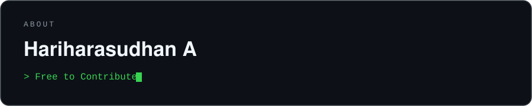
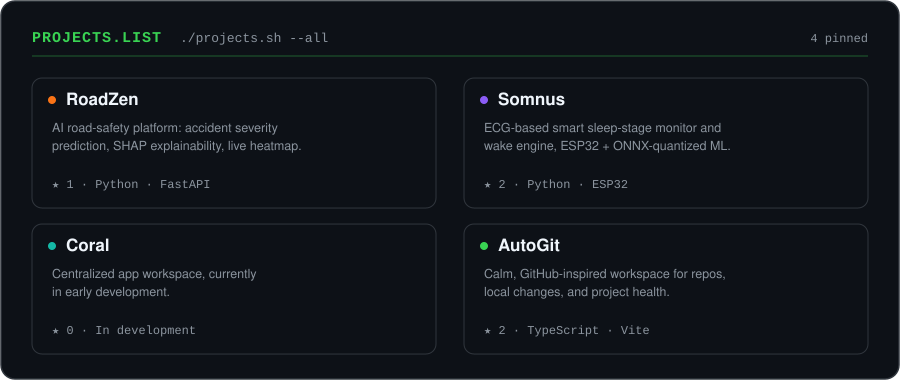

<h1 align="center"> Hey , I'm Hariharasudhan </h1>
<h3 align="center">Undergraduate CSE @ MEPCO Schlenk Engineering College, Sivakasi, Tamil Nadu, India</h3>

  

  

  
  
  

  

---

## About Me

Full-stack developer and AI enthusiast building open-source projects, AI applications, and agentic workflows.

- 🎓 Undergraduate CSE, currently exploring AI/ML, backend systems, and agentic AI workflows
- 🌱 Google Developer Program member — badges: **Google Maps Platform Innovator**, **Google Cloud & NVIDIA Community**, **Gemini Enterprise Agent Ready**
- 💬 Ask me about DSA, LeetCode grinding, or wiring up AI agents to actually ship things

  
  
  

---

## Skills

**Languages & Databases**

  
  
  
  
  
  
  
  
  

**Tools & Platforms**

  
  
  
  
  
  
  

  
  
  
  

**Deployment, Monitoring & Code Quality**

  
  
  
  
  

  
  
  

**Agentic Tools & IDEs**

  
  
  
  
  
  
  

**Models I Experiment With**

  
  
  
  
  
  
  

  <picture>
    <source media="(prefers-color-scheme: light)" srcset="https://www.gitskins.com/api/section/stack?username=hariharasudhan-29507&theme=zen&mode=light" />
    
  </picture>

---

## Projects

**[🚧 RoadZen](https://github.com/hariharasudhan-29507/ROADZEN)** — An AI-powered road-safety platform that predicts accident severity in real time with an XGBoost classifier, explains each prediction using SHAP, and pairs it with an interactive accident heatmap, a six-chart analytics dashboard, a safety chatbot, and an emergency-alert dispatch system, all served through FastAPI.

**[😴 Somnus](https://github.com/hariharasudhan-29507/SOMNUS-AI)** — An end-to-end, low-cost sleep-stage monitoring and smart alarm system: an ESP32 + AD8232 sensor captures single-lead ECG, extracts HRV metrics in real time, and an ONNX-quantized XGBoost model predicts sleep stages so the smart wake engine can trigger the alarm during light sleep instead of deep sleep.

**[🌊 Coral](https://github.com/hariharasudhan-29507/CORAL)** — A centralized app workspace, currently in early development.

**[⚙️ AutoGit](https://github.com/hariharasudhan-29507/AUTOGIT)** — A calm, GitHub-inspired workspace for managing repositories, tracking local changes, and monitoring project health, with Clerk-based GitHub/Google auth, a typed API client boundary for a Render backend, and a security model built around RLS, CSRF protection, and audit logging.

  

---

## Highlights

  <picture>
    <source media="(prefers-color-scheme: light)" srcset="https://www.gitskins.com/api/section/highlights?username=hariharasudhan-29507&theme=zen&mode=light" />
    
  </picture>

---

## Stats

  
  

  

  

## Heatmap

  <picture>
    <source media="(prefers-color-scheme: light)" srcset="https://www.gitskins.com/api/section/heatmap?username=hariharasudhan-29507&theme=zen&mode=light" />
    
  </picture>

## LeetCode

  

---

## Connect

  
  
  
  

  

<h3 align="center">Hariharasudhan</h3>

📧 <a href="mailto:sudanayyappan_bcs28@mepcoeng.ac.in">sudanayyappan_bcs28@mepcoeng.ac.in</a> — feel free to connect!

⭐ If you like what you see, consider starring one of my repos above!

  <a href="#hey-im-hariharasudhan-">⬆ Back to top</a>

